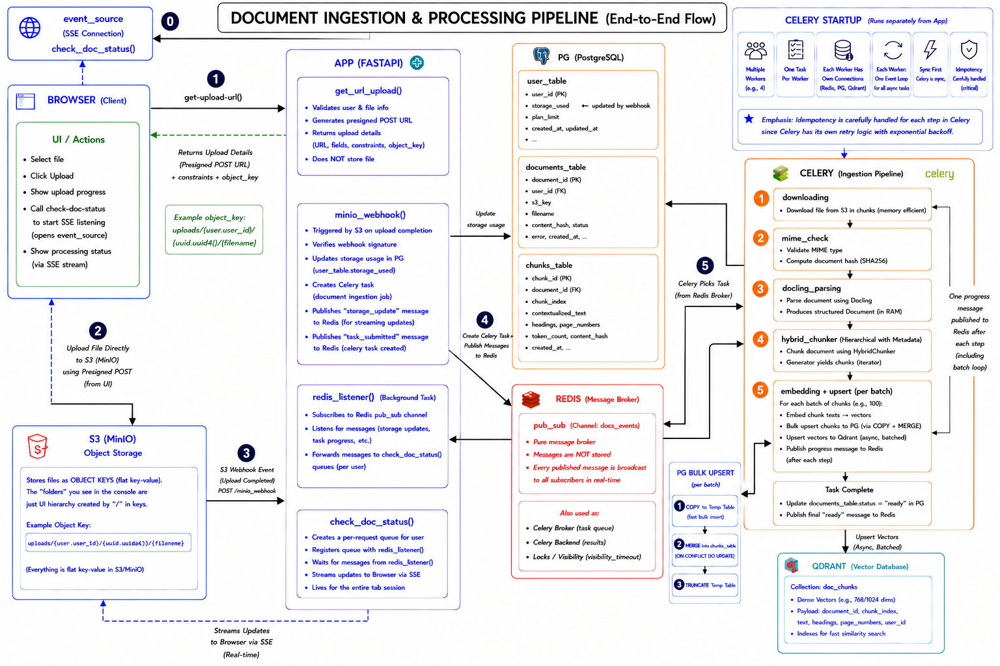

# Docai (rag)

Check aws deployment at [docai.codes](https://docai.codes)

`fastapi` | `docling` | `fastembed` | `qdrant` | `celery` | `redis` | `google interactive api` | `logfire` | `onnx runtime` | `presidio` | `tenacity` | `boto3` | `aiobreaker` | `pyjwt` | `aws rds` | `ec2` | `s3 (event bridge)` | `docker` | `Nextjs`

---

## Key Features

*   **Direct-to-S3 Uploads & Webhook Ingestion**: Generates secure pre-signed POST URLs in FastAPI, allowing the client to upload files directly to MinIO (S3 storage) without bottlenecking the API server, with MinIO event-listeners firing a webhook to notify the FastAPI server immediately upon upload.
*   **Asynchronous Processing**: Background document processing is offloaded to a Celery worker pool powered by Redis.
*   **Advanced Layout Parsing**: Integrates docling to extract clean layouts, table structures, and sections from PDF/Doc files. Docling is selected for its specialized TableFormer model (which recovers row, column, header, and cell relationships in complex tables) and its structure-aware Hybrid Chunker (which segments documents hierarchically along headings and tables before optimizing chunks to model token limits).
*   **Real-time Ingestion Tracking**: Uses Server-Sent Events (SSE) with Redis Pub/Sub to fanout or push real-time status updates ("processing", "completed", "error") to the frontend.
*   **Circuit Breakers & Retries**: Employs aiobreaker and tenacity around LLM and Vector search queries to ensure system resilience, incorporating exponential backoff, request timeouts, and fail-fast circuit breakers.
*   **Safety & Reliability Guardrails**:  Structured Output, prompt injection detection both at query and chunks, Microsoft Presidio hooks for PII scrubbing, and Vectera HHEM benchmarking for hallucination mitigation, confidence score, citations.
*   **Structured JSON Logging & Observability**: Employs a custom `JsonFormatter` and FastAPI middleware injecting request-scoped correlation IDs into stdout JSON logs—the faster, industry-standard approach for AWS CloudWatch ingestion. While designed for CloudWatch log streams, it also routes to Logfire for quick-access real-time debugging.
*   **Decoupled Authentication & Session Revocation**: Secure JWTs in HTTP-only, secure SameSite cookies, with Redis-backed real-time blacklisting and refresh-token tracking.

---

## Local Development Setup

### Prerequisites
*   [Docker](https://www.docker.com/) & [Compose](https://docs.docker.com/compose/)
*   [Python 3.12](https://www.python.org/)
*   [uv package manager](https://github.com/astral-sh/uv) 
*   [Node.js (v18+)](https://nodejs.org/) & [NPM](https://www.npmjs.com/)
*   [GNU Make](https://www.gnu.org/software/make/) (or run directly)

### Step 1: Configure Google OAuth
Before starting the application, you must configure Google OAuth:
1. Go to the [Google Cloud Console](https://console.cloud.google.com/).
2. Create OAuth 2.0 Client IDs for a Web Application.
3. Add `http://localhost:8000/api/v1/auth/login/google/callback` as an **Authorized redirect URI**.
4. Copy your Client ID and Client Secret into your `.env` file under `GOOGLE_CLIENT_ID` and `GOOGLE_CLIENT_SECRET`.

### Step 2: Spin up Local Databases & Storage
Launch PostgreSQL, Redis, Qdrant, and MinIO in background detached mode:
```bash
make docker-start
```

Once started, the following services and dashboards will be accessible:
*   **PostgreSQL**: Port `5432`
*   **Redis**: Port `6379`
*   **Qdrant**: API Port `6333` | Dashboard UI: [http://localhost:6333/dashboard](http://localhost:6333/dashboard)
*   **MinIO**: API Port `9000` | Console/Dashboard UI: [http://localhost:9001](http://localhost:9001)

### Step 3: Configure MinIO Event Notification
Hook MinIO storage bucket events to FastAPI webhook endpoint:
```bash
make minio-hook
```

### Step 4: Run Database Migrations
Create/update tables in PostgreSQL:
```bash
uv run alembic upgrade head
```

### Step 5: Run Celery Worker
Launch the background task processor queue:
```bash
make celery-start
```

### Step 6: Start FastAPI API Server
Start the Uvicorn/FastAPI backend:
```bash
make start
```

### Step 7: Start Next.js Frontend
Start the Next.js development server:
```bash
make frontend-start
```
Open [http://localhost:3000](http://localhost:3000) in your browser.

---

## Architecture Overview



---

## Production Deployment on AWS

The application is deployed on AWS utilizing an EC2 instance to run the core application services (FastAPI backend, Next.js frontend, Celery workers, Redis, and Nginx reverse proxy) in Docker, alongside AWS-managed resources (RDS PostgreSQL, S3, Ec2, EventBridge).

### Infrastructure Architecture
*   **Compute (EC2)**: A single EC2 instance (e.g., `t3.medium` or larger to handle OCR/parsing workloads) running Docker and Docker Compose.
*   **DatabaseCloud or a self-hosted Qdrant instance. (RDS)**: AWS RDS PostgreSQL instance for storing application data.
*   **Vector Search**: Qdrant deployed on aws
*   **Storage (S3)**: AWS S3 bucket for storing documents, configured with IAM roles for secure EC2 access.
*   **Event Notifications**: S3 Event Notifications configured via Amazon EventBridge to call the FastAPI webhook endpoint `/api/v1/ingestion/webhook/minio` on document uploads.

---

### Step-by-Step Deployment Instructions

#### 1. Server Provisioning & Networking
1. Launch an Ubuntu EC2 instance (min ram 2gb, ssd 10gb to work).
2. Provision an AWS RDS PostgreSQL instance.
3. Configure the **EC2 Security Group** to allow inbound traffic on:
   - Port `22` (SSH)
   - Port `80` (HTTP)
   - Port `443` (HTTPS)
4. Configure the **RDS Security Group** to allow inbound traffic on:
   - Port `5432` (PostgreSQL) from the EC2 instance's private IP.
5. Rent a domain, and set up a DNS A record pointing to your EC2 public IP.

#### 2. Pull Docker Images (Docker Hub or Custom Build)
Since the production Docker images have already been built and pushed to Docker Hub (`hardikkansal/docai-api:v1` and `hardikkansal/docai-frontend:v1`), Docker Compose will automatically pull them on the EC2 instance.

If you need to build and push custom images:
```bash
# Build and push API/Celery image
docker build -t <your-dockerhub-username>/docai-api:v1 -f Dockerfile .
docker push <your-dockerhub-username>/docai-api:v1

# Build and push Next.js Frontend image
docker build -t <your-dockerhub-username>/docai-frontend:v1 -f frontend/Dockerfile .
docker push <your-dockerhub-username>/docai-frontend:v1
```
*Note: If you push custom images, update the image names in `compose.prod.yml` before deploying.*

#### 3. Setup and Configuration on EC2
1. SSH into your EC2 instance and install Docker, Docker Compose, and Git:
   ```bash
   sudo apt update
   sudo apt install -y docker.io docker-compose-v2 git
   ```
2. Clone the repository onto the instance.
3. Create the production `.env` file based on `.env.example.prod`:
   ```bash
   cp .env.example.prod .env
   ```
4. Edit the `.env` file and update:
   - `DB_URL` with your AWS RDS database connection string.
   - `QDRANT_URL` and `QDRANT_API_KEY` to connect to your production Qdrant instance.
   - S3 configuration: `minio_bucket` (set to your S3 bucket name) and `minio_region`.
   - Configure Gemini/OpenAI credentials (`GEMINI_KEY`).

#### 4. SSL Certificate Initialization
1. In `init-letsencrypt.sh`, update the `domains` array with your domain name (e.g., `domains=(yourdomain.com www.yourdomain.com)`) and add your email.
2. In `nginx/nginx.conf`, you **must** update:
   - All `server_name` entries to match your custom domain.
3. Run the initialization script to request Let's Encrypt certificates and configure Nginx:
   ```bash
   sudo rm -rf ./certbot
   sudo chmod +x init-letsencrypt.sh
   sudo ./init-letsencrypt.sh
   ```

#### 5. Launch the Stack
Start the production docker-compose services in background detached mode:
```bash
docker compose -f compose.prod.yml up -d
```

#### 6. Database Migrations
Run Alembic migrations inside the API container to initialize the RDS database:
```bash
docker compose -f compose.prod.yml exec api alembic upgrade head
```

#### 7. AWS S3 IAM & CORS Configuration
For direct-to-S3 uploads to succeed from the client browser:
1. **S3 CORS Policy**: Configure the CORS settings on your S3 bucket to allow uploads from your domain. Go to **S3 Bucket** > **Permissions** > **Cross-origin resource sharing (CORS)** and paste:
   ```json
   [
       {
           "AllowedHeaders": [
               "*"
           ],
           "AllowedMethods": [
               "POST",
               "GET"
           ],
           "AllowedOrigins": [
               "http://localhost:3000",
               "https://docai.codes"
           ],
           "ExposeHeaders": []
       }
   ]
   ```
2. **IAM Policy**: Ensure your EC2 instance IAM role has this policy
   ```json
   [
      {
      "Version": "2012-10-17",
      "Statement": [
         {
            "Effect": "Allow",
            "Action": "s3:ListAllMyBuckets",
            "Resource": "*"
         },
         {
            "Effect": "Allow",
            "Action": [
               "s3:GetObject",
               "s3:PutObject",
               "s3:PutObjectAcl"
            ],
            "Resource": [
               "arn:aws:s3:::docai-bucket-v1/*"
            ]
         },
         {
            "Effect": "Allow",
            "Action": [
               "s3:ListBucket"
            ],
            "Resource": [
               "arn:aws:s3:::docai-bucket-v1"
            ]
         }
            ]
      }
   ]
   ```

#### 8. Configure S3 Webhook Notifications
To trigger processing as soon as files are uploaded directly to S3:

1. In the AWS S3 Console, navigate to your bucket.
2. Under **Properties** > **Amazon EventBridge**, turn on EventBridge notifications for your bucket.
3. In the Amazon EventBridge Console, create a new rule that listens to Amazon S3 `Object Created` events.
4. Set the **Target** as an **API destination**.
5. Configure the API destination with:
   - HTTP Method: `POST`
   - Endpoint: `https://yourdomain.com/api/v1/ingestion/webhook/minio`
   - Authorization Header: matching the token set in your `.env` for `MINIO_NOTIFY_WEBHOOK_AUTH_TOKEN_FASTAPI`.
